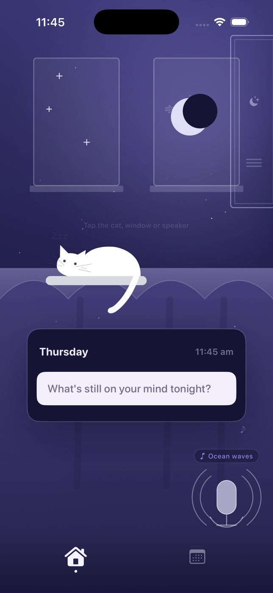
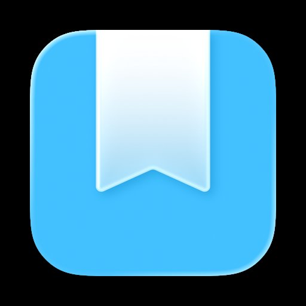
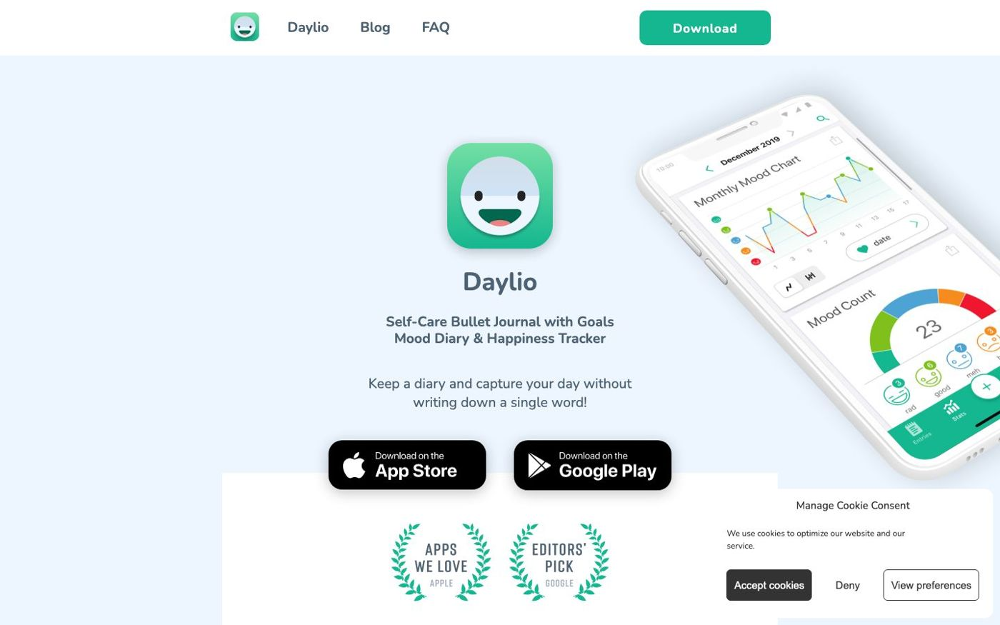
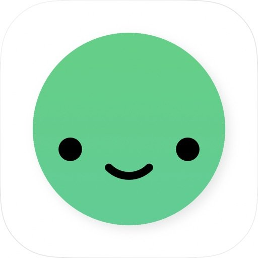
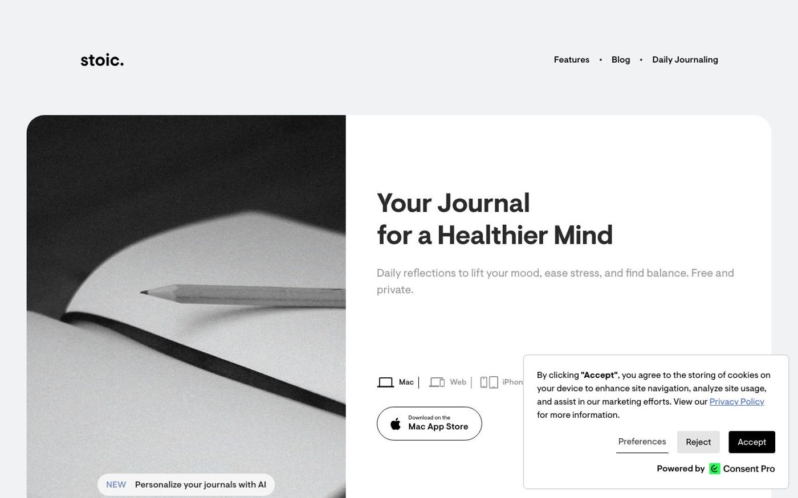
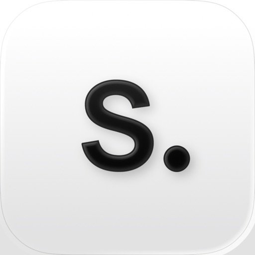
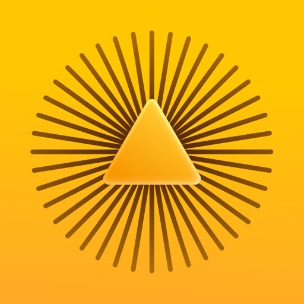
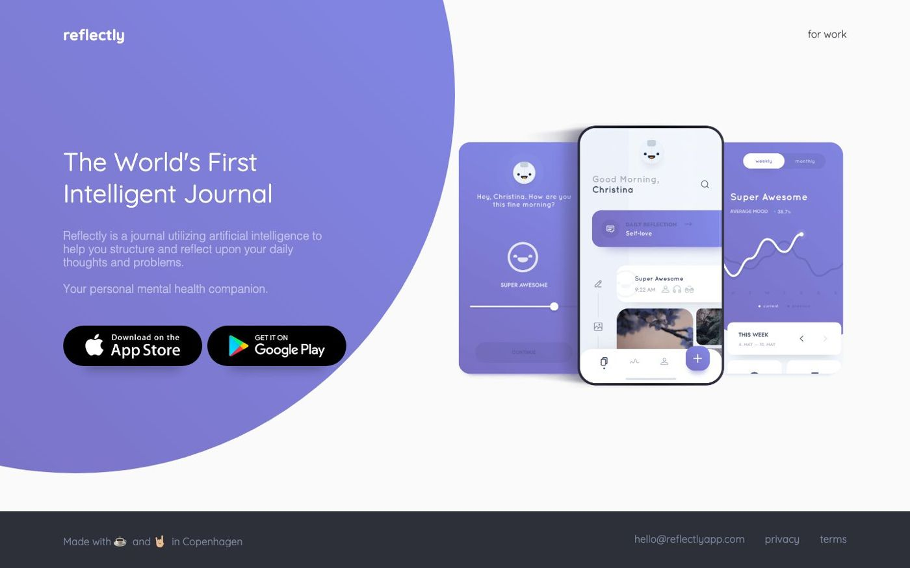

Finding the best journaling apps is harder than it looks. There are dozens of options, and most of them will end up collecting dust after two weeks. After testing six of them for at least a week each, we found that the apps people actually stick with tend to be the ones built around a specific moment: bedtime, a five-minute morning ritual, or a quick end-of-day mood tap.

Here's what we found, ordered by who each app is genuinely built for.

## Key takeaways

- For bedtime and voice journaling, meow note is the only app here designed around the nighttime moment, with sleep ambience and voice input for when you're too tired to type.
- Day One is the most capable all-around journal if you want rich entries with photos and a searchable, long-term archive.
- If you hate writing but want to track how you feel, Daylio lets you check in with a mood tap in under 30 seconds, no text required.

## The six best journaling apps at a glance

| App | Best for | Platforms | Price |
|---|---|---|---|
| meow note | Bedtime and voice journaling | iPhone | From $2.99/mo |
| Day One | Long-form, power journaling | iOS, Android, Mac, Windows, Web | Free; from $49.99/yr |
| Daylio | Mood tracking without writing | iOS, Android | Free; premium in-app |
| stoic. | Guided evening reflection | iOS, Mac, Web | Free; premium in-app |
| 5 Minute Journal | Quick morning gratitude habit | iPhone, iPad, Apple Watch, Mac | From $4.99/mo |
| Reflectly | AI-prompted daily check-ins | iOS, Android | Free; premium in-app |

## How we chose

We used each app for at least one week, paying attention to:

- **Setup friction.** How long before you're actually writing your first entry?
- **The nighttime test.** Does it feel calm to open at 10pm, or does it feel like opening a task manager?
- **Feature honesty.** We note when a free tier is genuinely useful and when it's mainly a trial.
- **Platform coverage.** For apps beyond meow note, we checked whether Android and web access work in practice.

---

## 1. meow note: best for bedtime and voice journaling

**Tagline:** Sleep starts with a quieter mind.

meow note is the only journaling app here built specifically for the end of the day. You open it at bedtime, not at lunch. The design reflects that: a dark, cozy night-room with a sleepy cat, soft ambient sounds you can play while you write, and a mood check-in woven into the routine.

**What makes it different.** The voice input. When you're too tired to type, you can just talk the day out. Speak what's on your mind and the app saves it as a journal entry, so you still get a written record without a keyboard at midnight. For people who lie awake replaying conversations or unfinished work, being able to speak it out is a genuine release.

The morning review is a quiet but useful detail: the next morning, meow note shows you what you wrote the night before alongside your Apple Health sleep data. Over time, you start to see whether the nights you wrote before bed actually connect to how you slept.

**What to know.** meow note is iPhone-only. No Android, no web app. It's also purpose-built for bedtime, so if you want to log lunch notes or document your whole day, a different app fits better. This is a wind-down tool.

**Pricing:** Free to download; membership from $2.99/month or $24.99/year, with a free trial. Confirmed via App Store, September 2026.

**Best for:** iPhone users who want a calm bedtime ritual, especially if they're too tired to type but still need to clear their head. Pairs well with [journaling for sleep](/blog/journaling-for-sleep) if you want to understand why timing matters.

[Download meow note](https://apps.apple.com/app/id6776287385)

---

## 2. Day One: best for long-form, power journaling

**Tagline:** Your journal for life.

Day One is the app that serious journalers tend to converge on. You can attach photos, video, audio recordings, and drawings to an entry. There's a searchable timeline, multiple separate journals, end-to-end encryption, an "On This Day" view, and apps across iPhone, iPad, Apple Watch, Android, Mac, Windows, and the web.

**What makes it work.** The writing experience itself. Day One gets out of your way once you're in an entry: clean interface, good typography, no distractions. For people building a real long-term record of their life, it's the most complete option here.

**What to know.** The free tier is limited. Most of what makes Day One worth using sits behind a paid plan. The Silver tier ($49.99/year) adds unlimited photos and cross-device sync, which is the realistic entry point. Gold ($74.99/year) adds AI features and audio transcription.

Day One's website (dayoneapp.com) was behind bot protection during our testing, so we weren't able to capture a live screenshot. The app itself is polished and well-reviewed across platforms.

**Pricing:** Free tier available; Silver $49.99/year, Gold $74.99/year. Confirmed at dayoneapp.com/pricing.

**Best for:** Dedicated journalers who want a rich, searchable life archive with photos, audio, and cross-platform access.

---

## 3. Daylio: best for mood tracking without writing

**Tagline:** Keep a diary and capture your day without writing a single word.

Daylio doesn't ask you to write anything. You tap a mood face (rad, good, meh, bad, awful), tap a few activity icons for what you did that day, and optionally add a short note. That's the whole entry. It takes about 20 seconds.

**What makes it work.** The lowest barrier to starting of any app on this list. The mood charts over time are genuinely interesting once you've logged for a few weeks. The streak system is motivating without being harsh.

**What to know.** Daylio is a mood tracker with optional notes, not a real journal. If you want to write, you'll quickly hit its limits. The text field is small and there are no formatting options or prompts. If you want to reflect in words, something else fits better. But if you mainly want a quick visual log of how you feel across the week and month, Daylio is excellent at that specific thing.

One practical limitation: without written context, mood entries can become hard to interpret after a few months. "Bad" on a Tuesday in March is hard to decode a year later.

**Pricing:** Free to download; premium subscription available in-app.

**Best for:** People who want a habit-friendly mood log with almost no friction. Also works well as a complement to a more writing-focused app.

---

## 4. stoic.: best for guided evening reflection

**Tagline:** Your journal for a healthier mind.

stoic. is built around structured daily reflection. Every day has a morning check-in and an evening review, each guided by prompts drawn from Stoic philosophy: What do you want to focus on today? What went well? What could you improve? You rate your mood and energy, and the app tracks patterns over time.

**What makes it work.** The prompts solve the blank-page problem. Instead of staring at an empty text field, you answer a few specific questions. That structure makes it easier to build a consistent habit, especially in the evening when you're tired and an open-ended prompt can feel too demanding.

The Stoic framing also suits people who like to think through problems methodically rather than just vent.

**What to know.** The philosophy-based prompts are a strong flavor. If you'd rather free-write than answer guided questions, stoic. may feel like filling out a form. It's also available for iOS, Mac, and web, but there's no Android app.

**Pricing:** Free to download; premium subscription and lifetime options available in-app.

**Best for:** People who want a structured morning/evening reflection habit, especially those who freeze in front of a blank page. A good companion to [bedtime journal prompts](/blog/bedtime-journal-prompts) if you want to build your own prompt list.

---

## 5. Five Minute Journal: best for a short morning gratitude habit

**Tagline:** Feel better in just 5 minutes a day.

The Five Minute Journal (5MJ) by Intelligent Change follows the same format as the bestselling physical journal that 3+ million people have used. Each morning, you answer three prompts: what you're grateful for, what would make today great, and a daily affirmation. Each evening, three more: what was amazing today, how you could have made it better. Total time: about five minutes.

**What makes it work.** The constraint is the point. There's almost no decision-making involved. You're not choosing what to write about. You're filling in three boxes and moving on. That predictability makes it one of the easiest daily habits to maintain.

The Apple Watch integration is a practical extra: you can complete your morning check-in from your wrist before you pick up your phone.

**What to know.** Five Minute Journal is narrower than most apps here. If you want to write long entries or track your mood in detail, this isn't it. The format is fixed. Some people find the gratitude-only framing too positive to be honest, particularly on hard days.

Also: this app is Apple ecosystem only. No Android support.

**Pricing:** Free to download; premium from $4.99/month. Confirmed via App Store, September 2026.

**Best for:** People who want a lightweight, repeatable morning ritual with no setup and no blank page. Good for building the journaling habit before moving to a more open format.

---

## 6. Reflectly: best for AI-guided daily check-ins

**Tagline:** The world's first intelligent journal.

Reflectly uses AI to guide your daily reflection. Instead of a blank page, you answer a conversational question, rate your mood, and the app builds a weekly and monthly picture of your emotional patterns. The questions adapt based on what you write.

**What makes it work.** The conversational format is welcoming for new journalers. You don't have to decide what to write about. The AI asks, you answer, and it only takes a few minutes. It's a low-pressure way to build the habit.

**What to know.** Reflectly's depth is limited compared to other apps here. Entries are short and prompted, and the questions can feel repetitive after a few weeks. It also calls itself a "mental health companion," which overstates what it is. It's a guided mood diary, not a clinical tool.

**Pricing:** Free to download; premium subscription available in-app.

**Best for:** Beginners who want a gentle, conversational entry point into journaling, with no blank-page anxiety.

---

## Which one is right for you?

The biggest dividing line is when you want to journal and how much you want to write.

For a **bedtime ritual**, meow note is the only app here built for that specific moment. Voice input means you can use it even when typing feels like too much. If you want to understand why writing before bed can actually affect sleep, the [bedtime journal](/blog/bedtime-journal) overview is worth reading first.

For a **morning ritual**, Five Minute Journal is the most low-friction option. Three boxes, five minutes, done. stoic. works well if you want more depth in your morning and evening check-ins.

For **dedicated, long-form journaling**, Day One is the most capable. The paid plan is worth it if you're serious about building a long-term archive.

For **mood tracking without writing**, Daylio is the easiest. You can log a check-in before the end of a thought.

For **AI-guided prompts**, Reflectly removes the blank-page problem with conversational questions.

For **Android users**, Day One, Daylio, and Reflectly all have solid Android support.

---

## Frequently asked questions

### Which journaling app is best for sleep and bedtime?

For bedtime specifically, meow note is the strongest pick. It's built around nighttime reflection, with voice input for when you're too tired to type, ambient sounds to help you wind down, and a morning review that ties last night's entry to how you slept. No other app on this list is designed around the bedtime moment.

### What is the best free journaling app?

Daylio has the most genuinely useful free tier for habit-building, since the core mood-logging features cost nothing. stoic. and Reflectly both offer free access with optional premium. Day One's free tier exists but is limited. meow note offers a free trial before the membership begins.

### Are journaling apps private and secure?

Most apps here store entries on your device and in the cloud. Day One offers end-to-end encryption on its paid plans, meaning even Day One can't read your entries. meow note keeps your entries private to your account. If security is a top concern, read each app's privacy policy before committing to one.

### Is journaling actually good for sleep?

Writing at the end of the day can help offload unfinished thoughts before you try to sleep. One study in the *Journal of Experimental Psychology* found that writing a specific to-do list for the next day before bed helped people fall asleep faster than writing about completed tasks ([Scullin et al., 2018](https://doi.org/10.1037/xge0000374)). That said, journaling is a support habit, not a clinical treatment. If sleep problems have persisted for months and are affecting your daily functioning, speaking with a doctor or mental health professional is a better first step.

### Do I need a journaling app or would a notes app work?

A notes app works fine if you already use one consistently. The advantage of a dedicated journaling app is the habit infrastructure: reminders, streaks, dated entries, and prompts that show up automatically. If you tend to forget to write, or if a blank page stops you, a dedicated app gives you more structure than Apple Notes or Notion.

### Which journaling app works on Android?

Day One, Daylio, and Reflectly all support Android. stoic., meow note, and Five Minute Journal do not. For Android users who want a full-featured journal, Day One is the most capable option.
