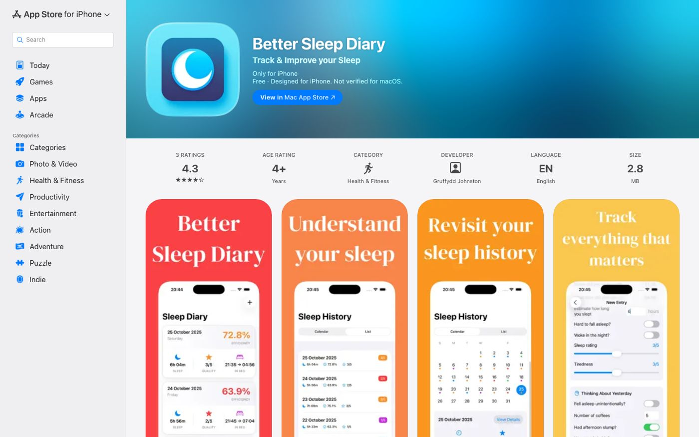
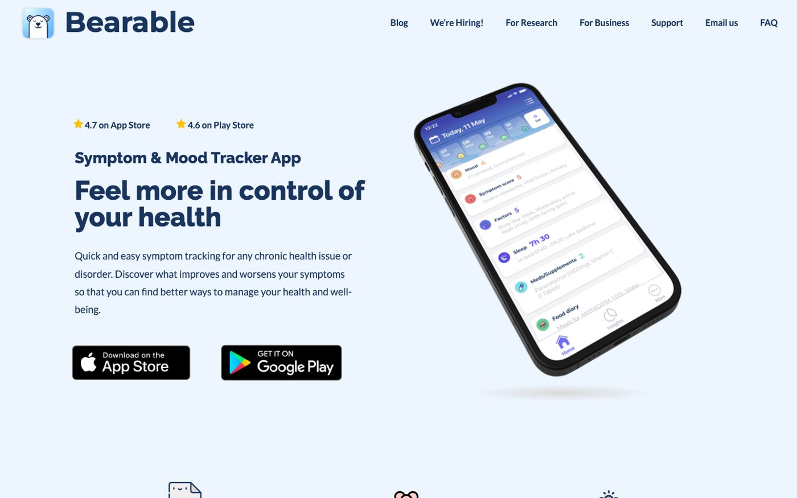
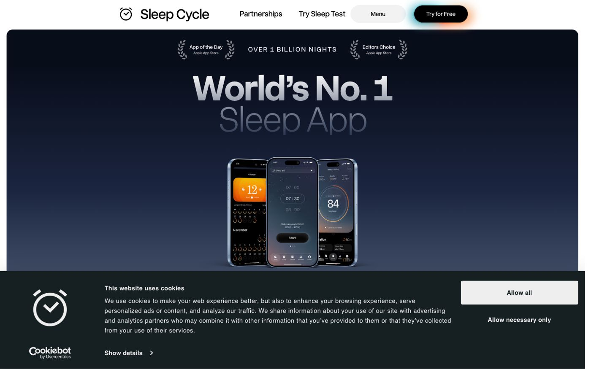
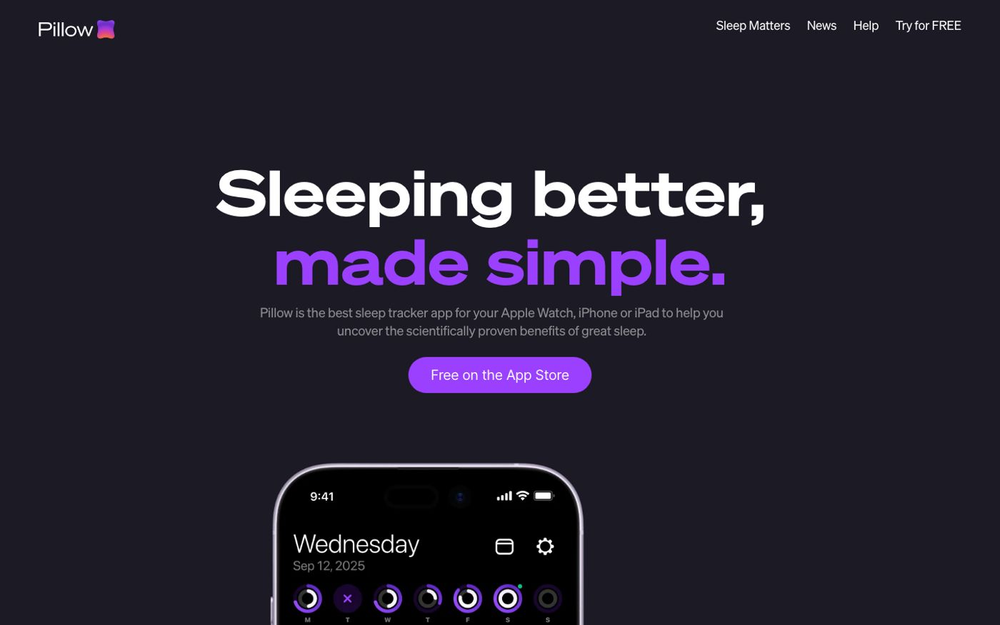

A sleep diary is one of the most recommended tools in sleep research, and also one of the most underused. The idea is simple: you log when you went to bed, how you slept, what might have affected it, and how you felt in the morning. Over a few weeks, patterns appear that are invisible inside any single night.

The tricky part is that most "sleep apps" are sleep *trackers*, not sleep diaries. They use your Apple Watch or iPhone's microphone to measure what happened while you were unconscious. A diary is different. It's intentional. You're recording what you ate, how stressed you felt, whether you scrolled for an hour before bed, and what the morning looked like. That's a different kind of data, and it requires a different kind of app.

These five are the best sleep diary apps on iPhone in 2026. Each does something meaningfully different.

## Key takeaways

- For bedtime journaling with voice input and a morning sleep summary: meow note.
- For the simplest free sleep log with no subscription: Better Sleep Diary.
- For tracking sleep alongside mood, medications, or chronic symptoms: Bearable.
- For automatic sleep stage tracking with light diary notes: Sleep Cycle.
- For Apple Watch users who want deep sleep data with a notes field: Pillow.

## Quick comparison

| App | Diary depth | Best for | Free version | Paid from |
|-----|-------------|----------|--------------|-----------|
| meow note | Deep (voice + text + mood) | Bedtime journaling | Yes | $2.99/mo |
| Better Sleep Diary | Simple log | Basic tracking | Fully free | n/a |
| Bearable | Moderate, with correlations | Health + sleep tracking | Yes | $6.99/mo |
| Sleep Cycle | Light (notes field) | Auto tracking + alarm | Yes | Subscription |
| Pillow | Light (notes field) | Apple Watch sleep data | Yes | $19.99/mo |

## How we chose these apps

We evaluated apps on four criteria: the sleep diary function had to be a real feature, not a footnote; the app had to be updated within the past year; it had to have enough user reviews to confirm the core UX actually works; and it had to be available on iPhone. Apps that are purely automatic trackers with a one-line "notes" field were left out. So were apps last updated in 2020.

---

## 1. meow note: best sleep diary app for bedtime journaling

**"Sleep starts with a quieter mind."**

[meow note](https://apps.apple.com/app/id6776287385) is a calming bedtime journal that doubles as a sleep diary. It's the only app on this list built around the journaling experience specifically, rather than tracking or health management.

**What it does.** At bedtime, you write or speak your thoughts (there's a voice recording option for nights when you're too tired to type). You check in on your mood. Ambient sleep sounds play in the background while you reflect. Streaks track your consistency. In the morning, it shows a summary of last night's entries alongside your sleep data pulled from Apple Health, so you can see both what you wrote and how you actually slept.

**What works.** The voice journaling is genuinely useful. Most people who fall off sleep diary habits do so because typing at 11pm feels like homework. Speaking for two minutes doesn't. The mood check-ins accumulate into patterns you can look back on after a few weeks, with the same payoff as a manual sleep diary but less friction.

**Limitations.** The app doesn't track sleep on its own; it reads your Apple Health data (from your Apple Watch or iPhone). iPhone only, no Android or web app. The diary and the sleep data live in the same place but serve slightly different purposes. If you want pure sleep stage analysis, you'll want a dedicated tracker too.

**Pricing.** Free to download; membership from $2.99/month or $24.99/year, with a free trial.

**Best for:** people who want to journal at bedtime and see how the night settled in the morning. If you want to reflect, not just measure, this is the right app. It fits naturally alongside a broader [bedtime journal](/blog/bedtime-journal) practice.

---

## 2. Better Sleep Diary: best free sleep diary app

**"Track and improve your sleep."**

[Better Sleep Diary](https://apps.apple.com/us/app/better-sleep-diary/id6754345892) does exactly what the name says and nothing more. It's a clean, free app for logging how you slept, what might have affected your night, and reviewing your sleep over time.

**What it does.** You log your bedtime, wake time, sleep quality, and any notes about what affected the night. The app shows your history as a chart so you can see trends.

**What works.** It's genuinely free with no subscription and no ads, which is rare. The interface is fast and low-friction. For someone who has been meaning to keep a sleep diary but never found a simple enough tool, this is the entry point.

**Limitations.** There's no mood tracking, no journaling, and no reflection component. The note field is basic. It's a log, not a diary in the richer sense. Also a relatively new app with limited reviews, though the ones that exist are positive.

**Pricing.** Fully free.

**Best for:** anyone who wants the simplest possible sleep log without a subscription. A good first step if you've never kept a sleep diary before.

---

## 3. Bearable: best sleep diary app for tracking multiple health factors

**"Feel more in control of your health."**

[Bearable](https://bearable.app) is a symptom, mood, and sleep tracker used by over 2 million people. It's the most feature-rich app on this list, and also the most complex.

**What it does.** You log your sleep time and quality alongside mood ratings, symptoms, medications, food, and other factors. Bearable then shows correlations: which factors seem to improve your sleep, which ones hurt it. It's designed for people managing chronic health conditions, but it works equally well for anyone trying to understand their sleep in context.

**What works.** The correlation view is the standout feature. After a few weeks of entries, Bearable can surface that, say, your sleep quality drops after days with high stress scores. That's something a simple sleep log would never reveal. That's a genuinely different kind of insight. The free version is generous. Available on iOS and Android.

**Limitations.** The interface takes time to learn. For someone who just wants a quick nightly log, Bearable will feel like too much. It's not built for bedtime reflection; it's built for health data. The sleep entry is a few fields, not a journal.

**Pricing.** Free with core features; $6.99/month or $34.99/year for premium (which unlocks correlations and unlimited history).

**Best for:** people who track multiple health factors and want to understand how sleep connects to mood, symptoms, or medication. Also worth considering if you already use a health tracker and want sleep in the same place. If you're specifically interested in the mood tracking side, pairing it with a [mood journal](/blog/mood-journal) habit adds the reflection layer Bearable doesn't provide.

---

## 4. Sleep Cycle: best for automatic tracking with light diary notes

**"World's no.1 sleep app."**

[Sleep Cycle](https://sleepcycle.com) tracks your sleep automatically using your iPhone's microphone or Apple Watch, and adds a light diary layer through sleep notes and mood check-ins.

**What it does.** It analyzes sound patterns while you sleep to detect sleep stages, records any snoring or sleep sounds, and wakes you during your lightest sleep phase using a smart alarm. The sleep notes feature lets you log factors (caffeine, stress, exercise, alcohol) before bed, and Sleep Cycle tracks whether those factors correlated with better or worse sleep over time. It also shows a brief morning mood check-in.

**What works.** The automatic tracking is reliable and has a long track record. Sleep Cycle has been around since 2009 and has over 29,000 ratings in the US App Store. The sleep notes system is a lightweight diary that connects your inputs to your outcomes without much effort.

**Limitations.** The diary function is minimal compared to the tracking function. You're selecting from preset factors rather than writing. If you want to reflect on the day or process emotions, Sleep Cycle isn't the tool for that. It's optimized for data, not narrative. Subscription required for full features.

**Pricing.** Free to download with basic features; see the [App Store listing](https://apps.apple.com/us/app/sleep-cycle-tracker-sounds/id320606217) for current Premium subscription pricing (multiple tiers available).

**Best for:** people who want their sleep tracked automatically and are happy with a simple notes system rather than a full diary. A good fit if you have sleep data already in Apple Health and want richer analysis.

---

## 5. Pillow: best for Apple Watch users who want detailed sleep data

**"Sleeping better, made simple."**

[Pillow](https://pillow.app) is an Apple-ecosystem sleep tracker with deep Apple Watch integration and a clean interface. Like Sleep Cycle, it's primarily an automatic tracker, but it includes a notes field and connects to Apple Health.

**What it does.** Pillow tracks sleep stages (light, deep, REM) using your Apple Watch or iPhone, generates a sleep quality score, and displays your history in a calendar view. You can add notes to any night's entry. It also records sounds during sleep.

**What works.** The Apple Watch integration is the strongest on this list. If you wear your watch to bed, Pillow gives you detailed sleep stage data in a well-designed interface. The calendar history view makes it easy to spot patterns across weeks. It also syncs with Apple Health.

**Limitations.** Premium pricing is high for a sleep tracker ($19.99/month or $49.99/year). The diary component is a notes field, not a journaling tool. For genuine reflection and mood tracking, you'd need to combine Pillow with a separate journaling app.

**Pricing.** Free to download with basic tracking; Premium from $19.99/month or $49.99/year (free trial available).

**Best for:** Apple Watch owners who want accurate sleep stage tracking and clean history visualization. Not the right pick if journaling is the goal.

---

## Which sleep diary app is right for you?

The answer depends on what you mean by "diary."

If you mean writing: you want to reflect, process the day, track your mood over time, and see how your sleep connected to how you felt. **meow note** is the right fit. It's the only app on this list built for that experience. You can read more about the approach in our guide on [journaling for sleep](/blog/journaling-for-sleep).

If you mean logging: you want to record bedtime and wake time, maybe a few notes, and see the history. **Better Sleep Diary** is the simplest free option. **Sleep Cycle** or **Pillow** work well if you also want automatic tracking alongside the log.

If you're managing health complexity (chronic symptoms, medications, or mood alongside sleep), **Bearable** is in its own category. It's less of a diary and more of a health correlation tool.

Most people start with automatic trackers and feel like something is missing. The data is there, but it doesn't tell them why. A journaling layer fills that gap.

## Frequently asked questions

### What is a sleep diary app?

A sleep diary app lets you record details about your sleep: when you went to bed, how long you slept, what might have affected the night, and how you felt in the morning. Some apps add automatic tracking (measuring sleep stages via Apple Watch or microphone). Others focus on the manual entry and reflection side. The two approaches serve different purposes.

### Is a sleep diary app the same as a sleep tracker?

No. A sleep tracker measures what happened while you were asleep, usually automatically. A sleep diary records what you *choose* to log, often including context the tracker can't see: stress levels, caffeine, what was on your mind before bed. The most useful apps for understanding sleep tend to combine both.

### Can a sleep diary app help with insomnia?

Sleep diaries are part of the standard assessment for insomnia, and CBT-I (cognitive behavioral therapy for insomnia) programs use them to identify patterns. Tracking your sleep can help you notice habits that are affecting your rest. That said, a sleep diary app is not a treatment for insomnia. If you've had trouble sleeping for more than a few weeks and it's affecting your daily life, talking to a doctor is the right next step. The [Sleep Foundation](https://www.sleepfoundation.org/insomnia/treatment/cognitive-behavioral-therapy-insomnia) has a clear overview of CBT-I as the recommended first-line treatment.

### Do I need an Apple Watch to use these apps?

Not for most of them. meow note, Better Sleep Diary, and Bearable work without an Apple Watch. All three rely on manual entry rather than automatic tracking. Pillow works best with an Apple Watch but has an iPhone-only mode. Sleep Cycle uses your iPhone's microphone if you don't have a watch.

### How long before a sleep diary shows useful patterns?

Most people notice something useful after two to three weeks of consistent entries. A full month gives you enough data to see whether patterns hold or were just a rough patch. The key is consistency: five entries a week is more useful than sporadic thorough ones.

### Which sleep diary app is free?

Better Sleep Diary is completely free with no subscription and no ads. meow note, Bearable, Sleep Cycle, and Pillow all offer free downloads with some features free and full access behind a subscription.
